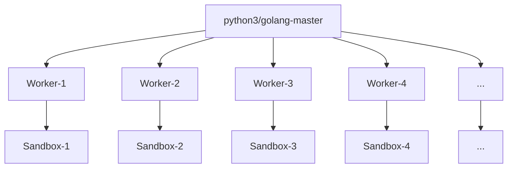

# Alcoj
A DooD (Docker out of Docker) Online-Judge project using linters and time tools to analysis the committed code, support python3 and golang.
## Structure
Container:

```mermaid
flowchart TD
    Master[python3/golang-master] --> Worker-1
    Master[python3/golang-master] --> Worker-2
    Master[python3/golang-master] --> Worker-3
    Master[python3/golang-master] --> Worker-4
    Master[python3/golang-master] --> Worker-5[...]

    Worker-1 --> Sandbox-1
    Worker-2 --> Sandbox-2
    Worker-3 --> Sandbox-3
    Worker-4 --> Sandbox-4
    Worker-5 --> Sandbox-5[...]
```
