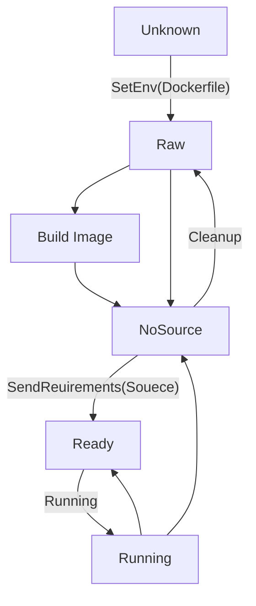

# Worker
## Overview
The service should be created by Factory  
This module is the smallest OJ unit, each unit maintains a sanbox Container internally  
This unit receives topic submissions and returns output + runtime information  
or expose object service ports
## Global Design
### Docker
```go
type Docker struct {
    ID      string
    Image   string
    Lang    string
    Version string
    Entry   int             // 0 shell, 1 
    cli     *client.Client  // private client
}
```
#### Status
0. Unknown: Docker engine not ready or fail to connect docker engine
1. Raw: Docker service ready
2. Building: Build Image using dockerfile
3. NoSource: Create container
4. Ready: Bind Source Folder
5. Running: Run Container
#### Lifecycle
The Worker module is an automaton with multiple loops.

#### Controller
* SetEnv:  
    * Transition: `Raw` → `Building` → `NoSource`  
    * Description: Initializes the environment settings, transitioning the system from a raw state, through the building phase, to a state where no source is available.  
* SendRequirements:  
    * Transition: `NoSource` → `Ready`  
    * Description: Processes and sends the required specifications, preparing the system for execution by moving it from a `NoSource` to a `Ready` state.  
* Run:
    * Utilizes `IsTheLastCase` to determine the workflow progression.  
    * Description: Run the code submitted
    * Flow Control:
        * If `IsTheLastCase` is false: Cycles through `Ready` → `Running` → `Ready`.
        * If `IsTheLastCase` is true: Transitions from `Ready` → `Running` → `NoSource`, signifying the completion of the final operation.
* Cleanup:  
    * Transition: `NoSource` → `Raw`
    * Description: Reverts the system to its original, unconfigured state (Raw), post-operations.
## Docker Action
0. Info
    * Description: similar to ping docker engine
1. Pull
    * Description: pull image if not exist
2. Build(not supported current)
    * Description: if support server, build image and expose ports to transparent proxy
3. Create
    * Description: Create container, and get id
4. Start
    * Description: start container
5. Run
    * Description: run shell to run the code in the sandbox
6. Clean
    * if the worker config changed, delete the container and image(not support)
