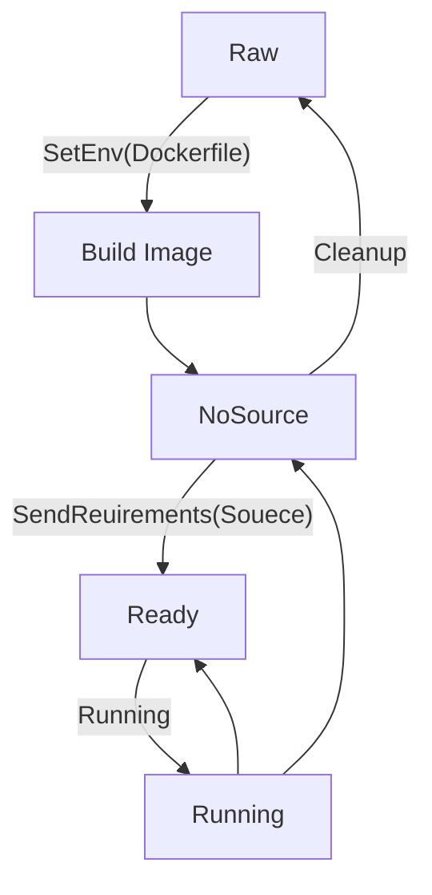

# Worker
## Overview
The service should be created by Factory  
This module is the smallest OJ unit, each unit maintains a sanbox Container internally  
This unit receives topic submissions and returns output + runtime information  
or expose object service ports
## Models
### Docker
#### Struct
```go
type Docker struct {
    ID      string
    Image   string
    cli     *client.Client  // private client
}
```
#### Status
0. Unknown: Docker engine not ready
1. Raw: Docker service ready
2. Building: Build Image using dockerfile
3. NoSource: Create container
4. Ready: Bind Source Folder
5. Running: Run Container
#### Lifecycle
The Worker module is an automaton with multiple loops.

#### Controller
* SetEnv:  
    * Transition: `Raw` → `Building` → `NoSource`  
    * Description: Initializes the environment settings, transitioning the system from a raw state, through the building phase, to a state where no source is available.  
* SendRequirements:  
    * Transition: `NoSource` → `Ready`  
    * Description: Processes and sends the required specifications, preparing the system for execution by moving it from a `NoSource` to a `Ready` state.  
* Run:
    * Utilizes `IsTheLastCase` to determine the workflow progression.  
    * Description: Run the code submitted
    * Flow Control:
        * If `IsTheLastCase` is false: Cycles through `Ready` → `Running` → `Ready`.
        * If `IsTheLastCase` is true: Transitions from `Ready` → `Running` → `NoSource`, signifying the completion of the final operation.
* Cleanup:  
    * Transition: `NoSource` → `Raw`
    * Description: Reverts the system to its original, unconfigured state (Raw), post-operations.

### Worker
Encapsulate the Docker module to provide gRPC methods for controlling the state of the automaton.
#### Functions Design
1. HealthCheck  
    * Description: Get current Server status.  
    * Request: `nil`  
    * Response:
    ```proto
    message HealthCheckResponse {
        bool status = 1;
    }
    ```
2. 
    * Description: Get current Docker statGetDockerStatusus.  
    * Request: `nil`
    * Response:
    ```proto
    message GetDockerStatusResponse {
        string status = 1; // The docker status above
        string msg = 2; // if the status don't allow, return error message
    }
    ```
3. SetEnv
    * Description: Set dockerfile.
    * Request:  
    ```proto
    message SetEnv {
        bool raw = 1;
        string image_name = 2;  // if raw
        bytes dockerfile = 3;   // if not raw
    }
    ```
    * Response:
    ```proto
    message SetEnvResponse {
        bool success = 1;
        string msg = 2; // error
    }
    ```
4. SendRequirements
    * Description: Send source file using stream. SendRequirements
    * Request:  
    ```proto
    // use stream
    message FileChunk {
        string filename = 1;
        bytes content = 2;
        bool is_last_chunk = 3;
    }
    ```
    * Response:
    ```proto
    // use stream
    message UploadStatus {
        bool success = 1;
        string message = 2;
    }
    ```
5. Run
    * Description: Run the source
    * Request:
    ```proto
    message RunRequest {
        bool IsTheLastCase = 1;
    }
    ```
    * Response:
    ```proto
    message RunResponse {

    }
    ```
6. Cleanup
    * Description: Run the source
    * Request:
    ```proto
    message CleanupRequest {

    }
    ```
    * Response:
    ```proto
    message CleanupResponse {

    }
    ```
####
